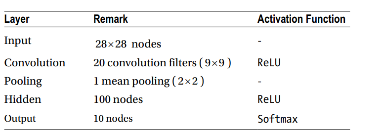

## admm/cnn

下面的网络结构借鉴于《matlab deeplearning》的第六章

相对应的程序有：

分布式的admm算法：
$$ \min_{W}\sum_{i=1}^{n} L_{i}(x_{i};W) $$
等价于
$$ \min_{W_{1} \cdots W_{n},Z} \sum_{i=1}^{n} L_{i}(x_{i};W_{i}) $$
$$ s.t. \quad W_{i} = Z \quad (i = 1,\cdots , n) $$
拉格朗日函数为：
$$ L_{c} = \sum_{i=1}^{n}L_{i}(x_{i};W_{i}) + \sum_{i=1}^{n} V_{i}\odot 
(W_{i}-Z_{i}) + \frac{c}{2} \sum_{i=1}^{n}\left \| W_{i} -Z \right\|_{F}^{2} $$
迭代公式
$$1.\quad W_{i}^{k+1} = arg\min_{W_{i}} (L_{i}(x_{i};W_{i}) + V_{i}^{k}\odot (W_{i}-Z_{i}^{k}) + \frac{c}{2}\left \| W_{i} - Z^{k} \right \|_{F}^{2})$$
$$\quad\qquad= arg\min_{W_{i}} (L_{i}(x_{i};W_{i}) +  \frac{c}{2}\left \| W_{i} - Z^{k}  + \frac{V_{i}^{k}}{c} \right \|_{F}^{2})\quad (\forall i) $$
$$2.\quad  Z^{k+1} = arg \min_{Z}\frac{c}{2} \sum_{i=1}^{n} \left \|Z -  W_{i}^{k+1} - \frac{V_{i}^{k}}{c} \right\|_{F}^{2} $$
$$= \frac{1}{n}\sum_{i=1}^{n}( W_{i}^{k+1} + \frac{V_{i}^{k}}{c}) $$
$$3.V_{i}^{k+1} = V_{i}^{k} + c(W_{i}^{k} - Z^{k+1}) \qquad (\forall i)$$
神经反向传播见《邱》

